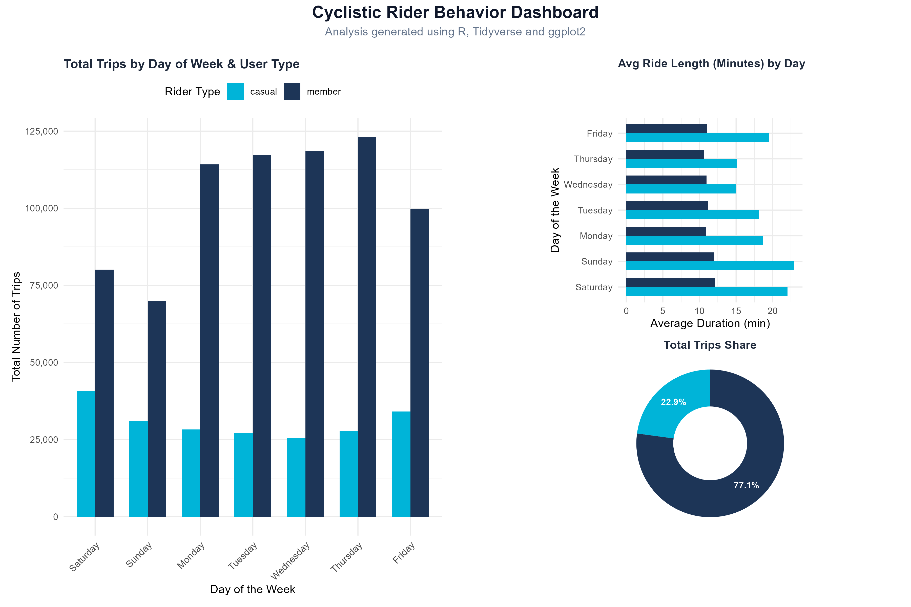

# 🚴‍♂️ Cyclistic Bike-Share Analysis
### Google Data Analytics Professional Certificate Capstone Case Study

## 📌 Introduction & Case Background
Cyclistic is a successful bike-share program in Chicago launched in 2016. The program has grown to a fleet of 5,824 bicycles that are geotracked and locked into a network of 692 stations across the city. 

The director of marketing believes the company’s future success depends on maximizing the number of annual memberships. Therefore, my team needs to understand how casual riders and annual members use Cyclistic bikes differently to design a new marketing strategy aimed at converting casual riders into annual members.

---

## 📑 The 6 Phases of the Data Analysis Process

### 1. Ask (The Business Problem)
The strategic goal is to convert casual riders into annual members. To inform this strategy, the analysis must answer three core questions:
1. How do annual members and casual riders use Cyclistic bikes differently?
2. Why would casual riders buy Cyclistic annual memberships?
3. How can Cyclistic use digital media to influence casual riders to become members?

**My Focus for this Project:** Analyzing historical trip data to identify trends, distinct behaviors, and user patterns to answer **Question 1**.

---

### 2. Prepare (Data Sources & Credibility)
* **Data Source:** Historical bike trip dataset from Cyclistic (managed by Motivate International Inc.). *Note: Data has been made available under an open-source license.*
* **Data Organization:** The data is structured in monthly/quarterly tables containing trip IDs, bike types, start/end times, station names, and user types (Member vs. Casual).
* **Data Privacy & Ethics:** Personally identifiable information (PII) is removed, meaning we cannot connect pass purchases to credit card numbers or addresses.
* **Storage Note:** The original clean dataset (`cleaned_combined_data.xlsx`) exceeds 114MB and is excluded from this repository due to GitHub's file size limits, but the exact transformation steps are preserved below.

---

### 3. Process (Data Cleaning & Transformation)
To handle millions of rows efficiently, the data processing was conducted across two environments:

#### A. SQL Server / Google Cloud BigQuery
I wrote optimized SQL queries to clean and stage the data:
* Checked and removed duplicate records based on unique trip tokens.
* Handled missing values (`NULL` values) in critical fields like station names and geographic coordinates.
* Engineered new metrics: `ride_length` (calculating total time spent in minutes) and `day_of_week` (extracting the day index where 1 = Sunday, 7 = Saturday).

*Refer to `/01_data_cleaning_and_table_creation.sql` and `/02_final_metrics_extraction.sql` for the complete query logic.*

---

### 4. Analyze & Share (Data Exploration & Visualization)
Using **R (RStudio)** and specialized visualization libraries, I performed data aggregation and statistical analysis to isolate the behavioral differences between users.

#### Final Interactive Dashboard
Here is the visual representation of the key trends extracted from the data:

#### Key Trends Identified:
* **Weekly Patterns:** Annual members maintain consistent trip volumes throughout weekdays (Monday–Friday), showing sharp peaks during standard commuting windows (8:00 AM and 5:00 PM). Conversely, Casual riders peak heavily on weekends (Saturday and Sunday) for leisure.
* **Duration Multipliers:** Casual riders log average trip lengths that are nearly double those of annual members, implying different utility models (commuting utility vs. recreational utility).

---

### 5. Act (Data-Driven Recommendations)
Based on the analysis, I recommend the following three marketing interventions:

1. **Targeted Weekend Memberships:** Design a specialized "Weekend Only" or "Seasonal Summer Pass" membership tier, as casual rider volume is highly concentrated during these specific periods.
2. **High-Duration Progression Campaigns:** Since casual riders cycle for longer durations, introduce digital marketing campaigns showing how much money frequent high-duration riders would save by switching to an annual flat-rate membership.
3. **Station-Based Digital Marketing:** Deploy digital ads and physical QR codes at key recreational stations (parks, waterfronts) during peak weekend hours, offering limited-time conversion discounts.

---

## 📬 Contact & Feedback
If you have any questions about the methodology, or SQL/R optimizations used in this case study, feel free to open an issue or connect with me!
